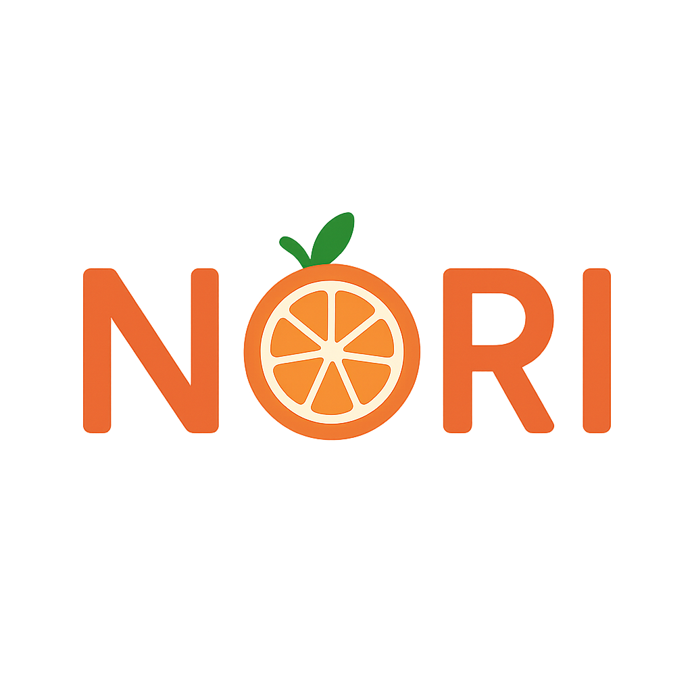

  
  <h1>Nori — AI Kitchen Assistant</h1>

---
## Project Overview 
Nori is an intelligent, privacy-focused kitchen assistant designed to help users manage their pantry, track ingredients, plan meals, and interact naturally through voice commands.
Nori uses local LLMs, OCR, speech-to-text, and computer vision to provide a seamless cooking and pantry management experience—all running securely on local hardware.
## Tech Stack & Backend Services
### Frontend

### Backend

### AI & ML
* Whisper.cpp (local speech recognition)
* Tesseract OCR
* Llama 3.2 (local intent + conversation)
## Key Features
### Pantry Tracking
- Automatically identifies items using OCR + image classification.
### Recipe Suggestions
- Personalized recommendations based on dietary preferences and inventory.
### Voice Interaction
- Local Whisper.cpp for STT + TTS for natural dialogue.
### Receipt Scanning
- Add items instantly by snapping a photo of a grocery receipt.
### Smart Alerts
- Low-stock and expiration detection.
## Mockups 

